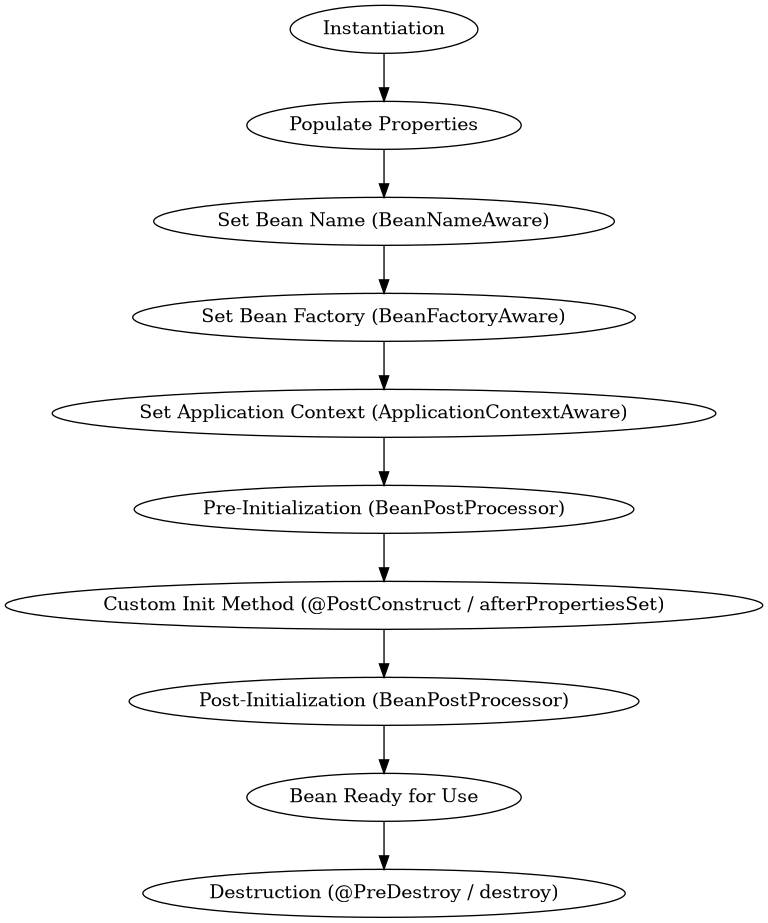

### 🌱 What is the Bean Lifecycle in Spring?

In Spring, a **bean** is an object that is managed by the **Spring IoC container**. The **bean lifecycle** refers to the series of steps that Spring follows to create, configure, and manage the lifecycle of these beans.

---

### 🔄 Bean Lifecycle Stages

Here’s a detailed breakdown of each stage:

---

#### 1. **Instantiation**
- Spring creates an instance of the bean using its constructor.
- This happens when the container starts or when the bean is requested (depending on its scope).

#### 2. **Populate Properties**
- Spring injects dependencies (via constructor, setter, or field injection).
- This is where DI happens.

#### 3. **Set Bean Name (Optional)**
- If the bean implements `BeanNameAware`, Spring calls `setBeanName()`.

#### 4. **Set Bean Factory (Optional)**
- If the bean implements `BeanFactoryAware`, Spring calls `setBeanFactory()`.

#### 5. **Set Application Context (Optional)**
- If the bean implements `ApplicationContextAware`, Spring calls `setApplicationContext()`.

#### 6. **Pre-Initialization (BeanPostProcessor)**
- Spring calls `postProcessBeforeInitialization()` from any `BeanPostProcessor`.

#### 7. **Custom Init Method**
- If defined, Spring calls the custom initialization method (e.g., `@PostConstruct` or specified in XML/config).

#### 8. **Post-Initialization (BeanPostProcessor)**
- Spring calls `postProcessAfterInitialization()` from any `BeanPostProcessor`.

#### 9. **Bean Ready for Use**
- The bean is now fully initialized and ready to be used by the application.

#### 10. **Destruction**
- When the application context is closed, Spring calls:
  - `@PreDestroy` method
  - Custom destroy method (if specified)
  - `DisposableBean.destroy()` if implemented

---

### 🧪 Example with Lifecycle Hooks

```java
@Component
public class LifecycleBean implements InitializingBean, DisposableBean {

    @PostConstruct
    public void init() {
        System.out.println("PostConstruct: Bean is initialized");
    }

    @Override
    public void afterPropertiesSet() {
        System.out.println("InitializingBean: afterPropertiesSet called");
    }

    @PreDestroy
    public void preDestroy() {
        System.out.println("PreDestroy: Bean is about to be destroyed");
    }

    @Override
    public void destroy() {
        System.out.println("DisposableBean: destroy called");
    }
}
```

---

### 📦 Interfaces and Annotations

| Interface / Annotation     | Purpose                          |
|----------------------------|----------------------------------|
| `InitializingBean`         | Custom logic after properties set |
| `DisposableBean`           | Custom logic before bean destruction |
| `@PostConstruct`           | Method to run after bean creation |
| `@PreDestroy`              | Method to run before bean destruction |
| `BeanPostProcessor`        | Intercept bean initialization steps |

---
Here’s a **visual diagram of the Spring Bean Lifecycle**:



### 🔍 Lifecycle Stages Explained

1. **Instantiation** – Spring creates the bean instance.
2. **Populate Properties** – Dependencies are injected.
3. **Set Bean Name** – If `BeanNameAware` is implemented.
4. **Set Bean Factory** – If `BeanFactoryAware` is implemented.
5. **Set Application Context** – If `ApplicationContextAware` is implemented.
6. **Pre-Initialization** – `BeanPostProcessor.postProcessBeforeInitialization()` is called.
7. **Custom Init Method** – `@PostConstruct` or `afterPropertiesSet()` is executed.
8. **Post-Initialization** – `BeanPostProcessor.postProcessAfterInitialization()` is called.
9. **Bean Ready for Use** – The bean is fully initialized.
10. **Destruction** – `@PreDestroy` or `destroy()` is called when the context is closed.
---
